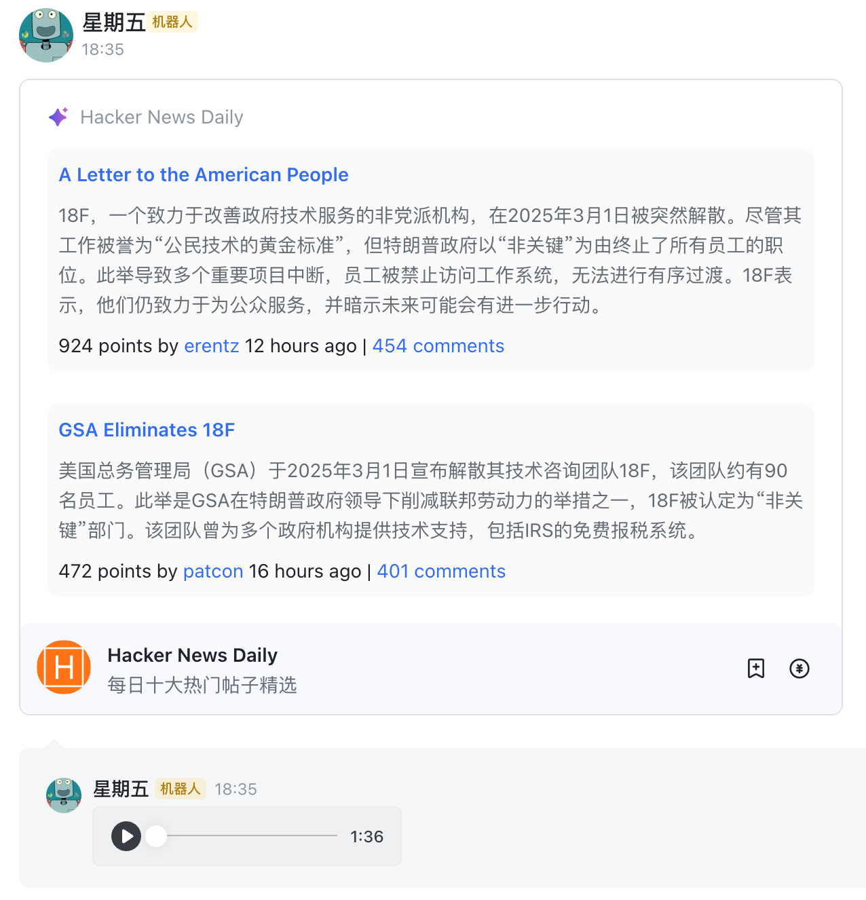

# lark-alert

每日 1 点（薅 DeepSeek 羊毛）自动生成通勤可听的技术简报：

1. 定时抓取前一天 Top10 新闻原文
2. AI 提炼核心内容
3. 生成播报级语音文件
4. 打包推送文本 + 音频日报

## Thanks

- [hackernews-daily](https://github.com/headllines/hackernews-daily) for inspiration

- [zeli](https://zeli.app/zh) for inspiration
